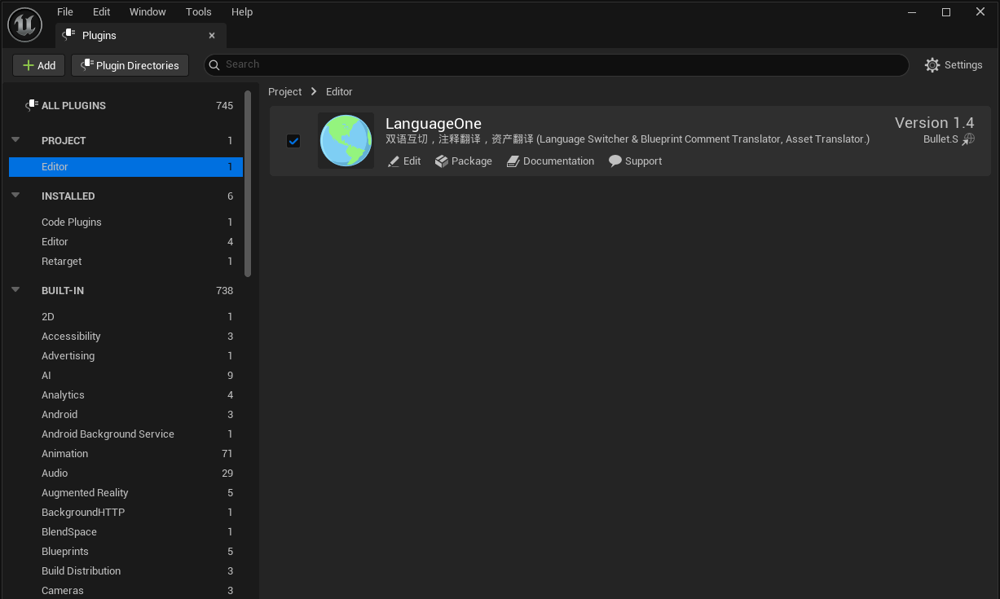
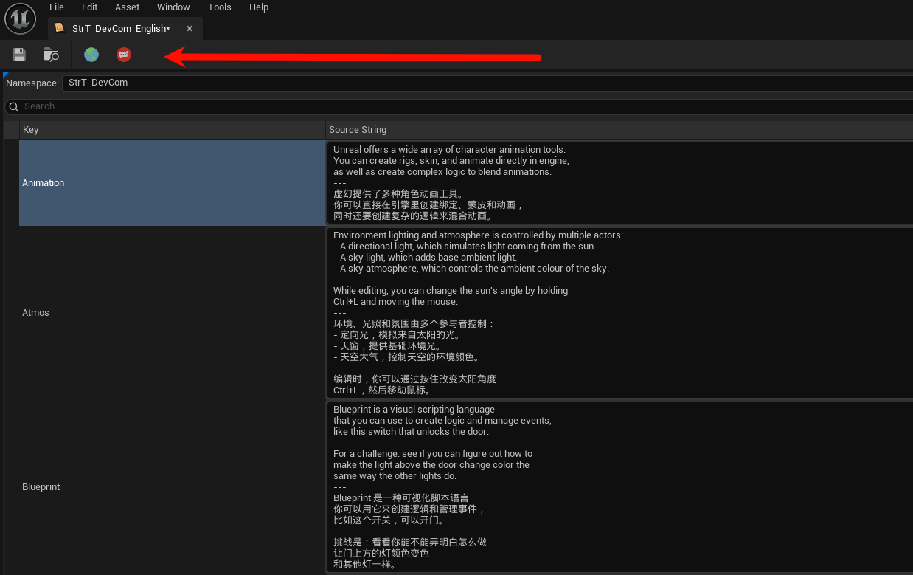
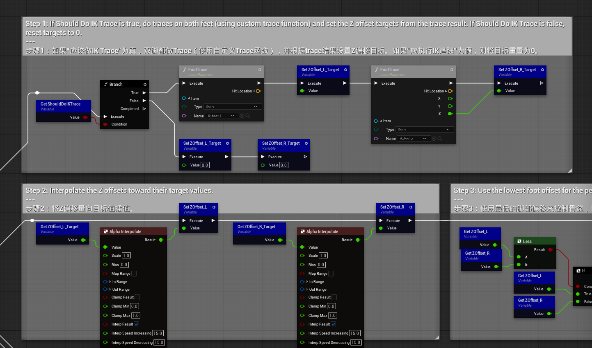
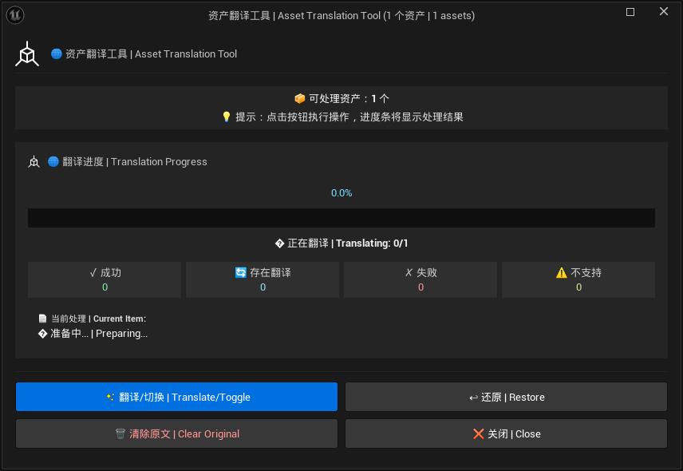
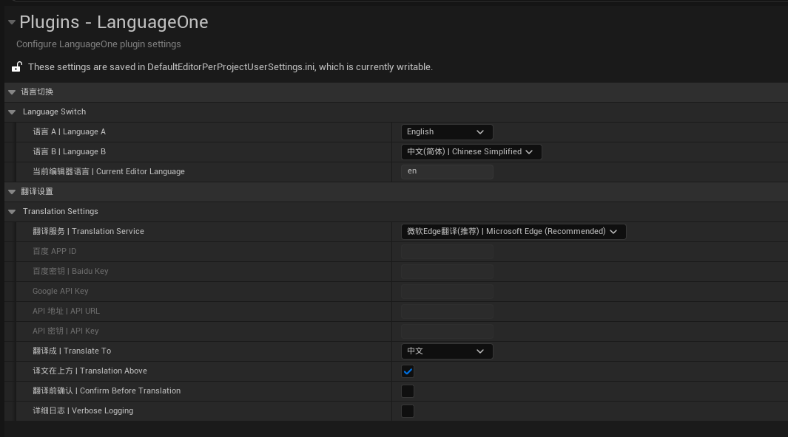

# LanguageOne

**虚幻引擎编辑器语言切换 & 资产翻译工具**  
Unreal Engine Editor Language & Asset Translation Tool

**[中文](#-中文说明) · [English](#-english)**

> [!NOTE]
> **📢 声明 | Disclaimer**  
> 插件使用 AI 辅助编写，主要用于个人学习和交流。  
> This plugin is AI-assisted and created for personal learning purposes.

---

## 🇨🇳 中文说明

### ✨ 功能特性

| 功能 | 说明 | 快捷键 |
|:---:|:---|:---:|
| 🌐 语言切换 | 11 种语言双向切换 | `Alt + Q` |
| 🔄 注释翻译 | 免费翻译蓝图注释 | `Alt + E` |
| 📦 资产翻译 | 翻译资产中的文本内容 | 右键菜单 |

**支持语言：** 中文(简/繁)、英语、日语、韩语、德语、法语、西班牙语、俄语、葡萄牙语、意大利语

**翻译服务：** 微软Edge（推荐）· 谷歌翻译 · MyMemory · 百度API · GoogleAPI

### 🚀 快速开始

**安装：** [Fab 下载](https://fab.com/s/dc840febb323) 或 [GitHub Releases](https://github.com/AniBullet/LanguageOne/releases)

**使用：**
- `Alt + Q` - 在 **语言A** 和 **语言B** 之间来回切换（在设置中配置）
- `Alt + E` - 翻译/还原蓝图节点注释（选中=部分，未选=全图）
- 右键资产 - 批量翻译资产（String Table、Data Table、Widget、Blueprint 等）
  - **翻译**：智能批量翻译，自动补全未翻译部分，跳过已翻译部分
  - **还原**：清除翻译内容，恢复到原文状态
  - **清除原文**：只保留译文（慎用）

**设置：** `编辑 > 编辑器偏好设置 > 插件 > LanguageOne`
- 语言A (Source)：默认语言（如英文）
- 语言B (Target)：目标语言（如中文）
- 译文位置：译文在上方/下方

### 📸 预览

| 启用插件 | 翻译按钮 |
|:---:|:---:|
|  |  |

| 蓝图翻译 | 批量翻译 | 设置界面 |
|:---:|:---:|:---:|
|  |  |  |

### 📖 详细文档

[完整使用指南](Docs/翻译功能使用说明.md)

### 📝 更新日志

**最新版本 v1.5:**
- ⌨️ **快捷键优化**：注释翻译快捷键从 `Ctrl+T` 改为 `Alt+E`，避免冲突。
- 🐛 **Bug Fix**: 修复蓝图选中节点翻译会翻译整个图表的问题

查看完整更新记录：[GitHub Releases](https://github.com/AniBullet/LanguageOne/releases)

---

## 🌍 English

### ✨ Features

| Feature | Description | Shortcut |
|:---:|:---|:---:|
| 🌐 Language Switch | Toggle between 11 languages | `Alt + Q` |
| 🔄 Comment Translation | Free blueprint comment translation | `Alt + E` |
| 📦 Asset Translation | Translate text content in assets | Context Menu |

**Languages:** Chinese (Simplified/Traditional), English, Japanese, Korean, German, French, Spanish, Russian, Portuguese, Italian

**Translation:** Microsoft Edge (Recommended) · Google Translate · MyMemory · Baidu API · Google API

### 🚀 Quick Start

**Install:** [Download from Fab](https://fab.com/s/dc840febb323) or [GitHub Releases](https://github.com/AniBullet/LanguageOne/releases)

**Usage:**
- `Alt + Q` - Toggle between **Language A** and **Language B** (Configured in settings)
- `Alt + E` - Translate/Restore blueprint node comments (selected=partial, none=all)
- Right-click assets - Batch translate assets (String Table, Data Table, Widget, Blueprint, etc.)
  - **Translate**: Smart batch translation, auto-completes untranslated parts
  - **Restore**: Removes translations, restores original text
  - **Clear Original**: Keeps translation only (Use with caution)

**Settings:** `Edit > Editor Preferences > Plugins > LanguageOne`
- Language A (Source): Default language (e.g. English)
- Language B (Target): Target language (e.g. Chinese)
- Position: Translation Above/Below

### 📖 Documentation

[Full Guide](Docs/TRANSLATION_GUIDE.md)

### 📝 Changelog

**Latest v1.5:**
- ⌨️ **Shortcut Update**: Comment translation shortcut changed from `Ctrl+T` to `Alt+E` to avoid conflicts.
- 🐛 **Bug Fix**: Fixed the issue that the blueprint selected node translation will translate the entire graph

See full history: [GitHub Releases](https://github.com/AniBullet/LanguageOne/releases)

---

## 📄 License

MIT License - See [LICENSE](LICENSE)

**Star ⭐ · PR Welcome**

Made with ❤️ by [Bullet.S](https://x.com/aniBulletCom)

