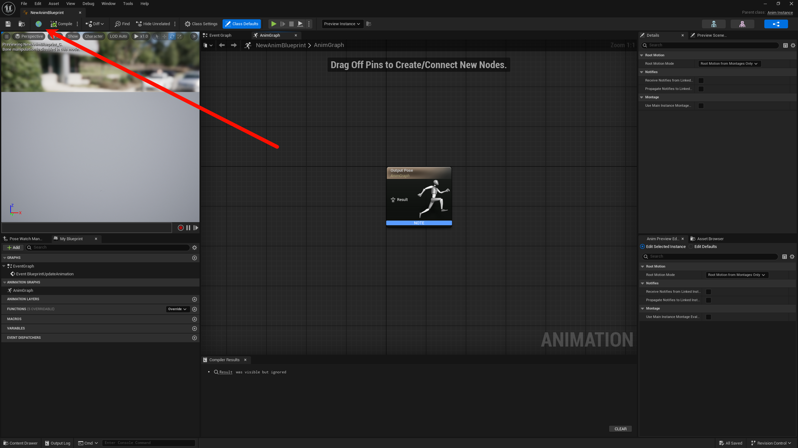
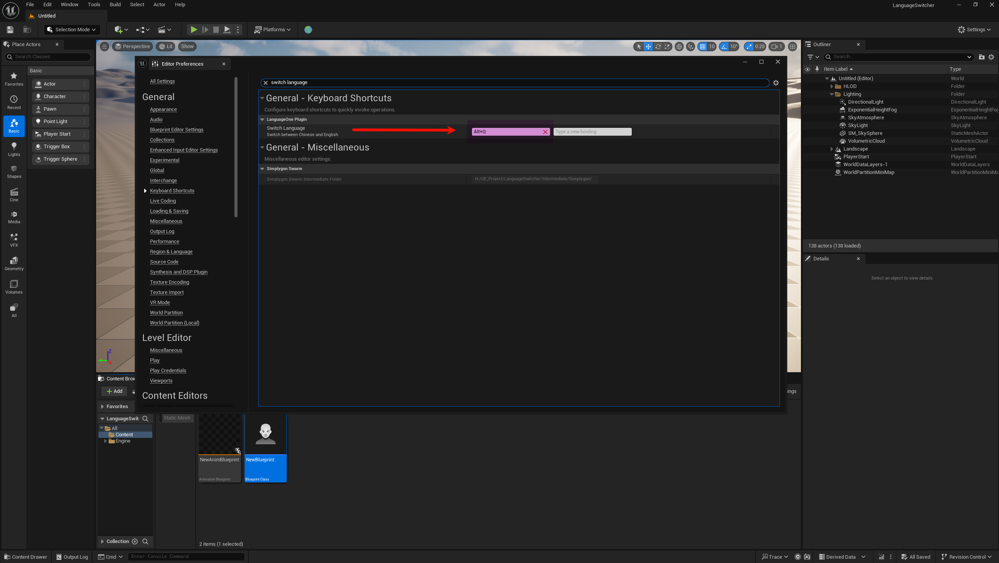

# LanguageOne

**虚幻引擎编辑器语言 & 蓝图注释翻译工具**

**[中文](#-中文说明) · [English](#-english)**

> [!NOTE]
> **📢 声明 | Disclaimer**  
> 本人代码能力一般，插件使用 AI 辅助编写，主要用于个人学习和交流。  
> This plugin is AI-assisted and created for personal learning purposes.

---

## 🇨🇳 中文说明

### ✨ 功能特性

| 功能 | 说明 | 快捷键 |
|:---:|:---|:---:|
| 🌐 语言切换 | 11 种语言双向切换 | `Alt + Q` |
| 🔄 注释翻译 | 免费翻译蓝图注释 | `Ctrl + T` |

**支持语言：** 中文(简/繁)、英语、日语、韩语、德语、法语、西班牙语、俄语、葡萄牙语、意大利语

**翻译服务：** 谷歌（免费）· 微软（免费）· LibreTranslate（免费）· 百度 API · Google API

### 🚀 快速开始

**安装：** [Fab 下载](https://fab.com/s/dc840febb323) 或 [GitHub Releases](https://github.com/AniBullet/LanguageOne/releases)

**使用：**
- `Alt + Q` - 切换语言
- `Ctrl + T` - 翻译注释（选中节点=翻译选中，未选中=翻译全图）
- 再按一次 = 还原

**设置：** `编辑 > 编辑器偏好设置 > 插件 > LanguageOne`

### 📸 预览

| 插件 | 按钮 | 设置 |
|:---:|:---:|:---:|
|  |  |  |

### 📖 详细文档

[完整使用指南](Docs/翻译功能使用说明.md)

### 📝 更新日志

查看完整更新记录：[GitHub Releases](https://github.com/AniBullet/LanguageOne/releases)

---

## 🌍 English

### ✨ Features

| Feature | Description | Shortcut |
|:---:|:---|:---:|
| 🌐 Language Switch | Toggle between 11 languages | `Alt + Q` |
| 🔄 Comment Translation | Free blueprint comment translation | `Ctrl + T` |

**Languages:** Chinese (Simplified/Traditional), English, Japanese, Korean, German, French, Spanish, Russian, Portuguese, Italian

**Translation:** Google (Free) · Microsoft (Free) · LibreTranslate (Free) · Baidu API · Google API

### 🚀 Quick Start

**Install:** [Download from Fab](https://fab.com/s/dc840febb323) or [GitHub Releases](https://github.com/AniBullet/LanguageOne/releases)

**Usage:**
- `Alt + Q` - Switch language
- `Ctrl + T` - Translate comments (selected nodes or entire graph)
- Press again = Restore

**Settings:** `Edit > Editor Preferences > Plugins > LanguageOne`

### 📖 Documentation

[Full Guide](Docs/TRANSLATION_GUIDE.md)

### 📝 Changelog

See full history: [GitHub Releases](https://github.com/AniBullet/LanguageOne/releases)

---

## 📄 License

MIT License - See [LICENSE](LICENSE)

**Star ⭐ · PR Welcome**

Made with ❤️ by [Bullet.S](https://x.com/aniBulletCom)

